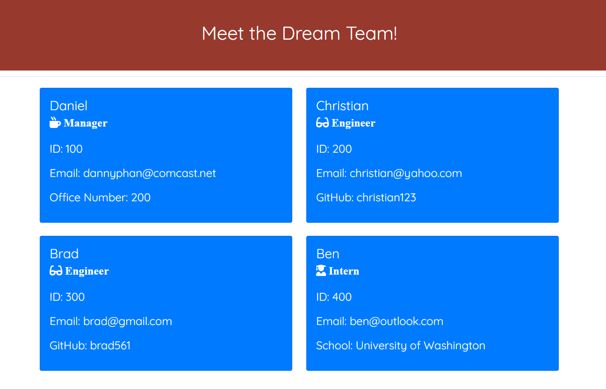

  
  # Team Profile Generator
  ## Table of Contents 
  * [Project Description](#description)
  * [Installation](#installation)
  * [Usage](#usage)
  * [Contributors](#contributors)
  * [Tests](#tests)
  * [License](#license)
  * [Questions](#questions)

  ## Project Description
  The Team Profile Generator is a command-line application that takes information about an employee on a software engineering team and generates an HTML webpage with their info displayed. The user will be prompted with questions regarding their role, whether they are a Manager, Engineer, or Intern. At the end of each set of questions, the user will be prompted whether they want to add another member to the dream team.  If they choose not too, then they're done! Your dream team is ready to go! 

  Below is an example of the generated HTML webpage:

  

  ## Installation
  Before running the application, the user must execute the command "npm install" to install all of the required dependencies. Tests were also created for this application, so you'll also want to execute the command "npm install --save-dev jest" After both commands are ran, then you're all set!

  Below is an example of how the application is ran and the results:

  https://drive.google.com/file/d/1B6IJ9ZX5IyGxVu_BT_icXSCQauUgbhYP/view

  ## Usage
  In order to run this application, you will open the terminal where this application resides. Then you will want to run the command "node index.js" Once that command is ran, you'll first be prompted with questions for a Manager role. You'll then be prompted with a question whether you want to add another member to the team, whether it be another Manager, Engineer, or Intern. If Manager, Engineer, or Intern are selected, then you'll be prompted with their corresponding questions. If not, then you have the option to be finished building your team and a HTML webpage is generated.
  
  ## Contributors
  Please feel free to create pull requests. They will be reviewed before merging. If you would like to make any major changes, please open an issue to discuss these changes.
  
  ## Tests
  Jest is used to run all of the tests. As mentioned above, tests used for this application, were to ensure that the data returned from the class constructors and functions, were behaving as expected. There are tests for each type of employee (Employee, Manager, Engineer, and Intern). In order to run these tests, run the command "npm run test"
  
  ## License
    This project is licensed through MIT License 

  ## Questions
  If you have any questions, please feel free to contact the owner of this repository. Their contact info is listed below:

  ### 
  GitHub Username: dannyphan6 

  GitHub Repository: https://github.com/dannyphan6 

  Email Address: dannyphan@comcast.net
